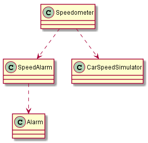
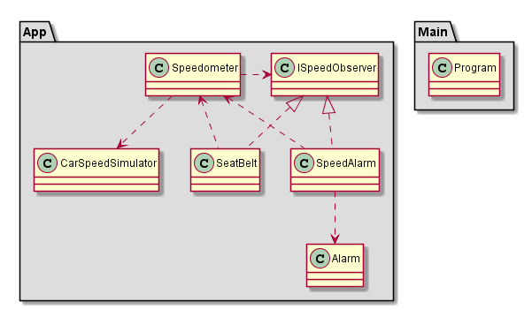

# Solution

This is the solution for the [problem](https://github.com/WonderTools/design-patterns/blob/master/Problem01/Assignment/ProblemStatement.md)

## Initialial Implementation

The rough uml representation of initial implementation is as shown in the image below. This is after removing the noise due to Program.

In the implementation, the Speedometer depends on CarSpeedSimulator. This is okay. The speedometer should depend on some mearsuring device for measuring the speed. In this case it is a simulator. We need to observe that the Speedometer is also dependent on SpeedAlarm. This is actually terrible. Why should a speedometer depend on a SpeedAlarm to do its job. The dependency here is not so much relatable to the business. When the speedometer is depending on SpeedAlarm, it can't be used in a system that doesn't have a speed alarm. Making it less reusable.

It would acutally be okay for a SpeedAlarm to depend on the Speedometer. After all the SpeedAlarm needs to know the speed to make an alarm. While programming, we realize that we have the con control at Speedometer, and this control has to be transferred to the SpeedAlarm. So at a design(compile) time we want SpeedAlarm to be dependent on Speedometer. At run time, we want Speedometer to be dependant on SpeedAlarm. Here we have compile dependencies opposing the run time dependencies. And to achieve this we can invert the dependencies using dependency inversion principle. On we have this dependency inverted, we can add Seatbelt that is again dependant on Speedometer. The uml reprentation of the solution was be as shown in figure

