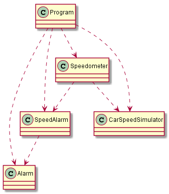

# Solution

This is the solution for the [problem] (https://github.com/WonderTools/design-patterns/blob/master/Problem01/Assignment/ProblemStatement.md)

## Initialial Implementation

The uml representation of initial implementation is as shown in the image above. Removing the noise due to the Program we get

![Initial Implementation Noise Removed] (Problem2.png)

In the initial implementation Speedometer is dependent on SpeedAlarm. This makes the Speedometer less uable. We want the speedometer to call the speed alarm when the speed changes at run time but we don't want the Speedometer to know about the SpeedAlarm at compile time. Here the expected run time and compile time dependencies are in different directions. This make it necessary to invert the dependencies.
 
